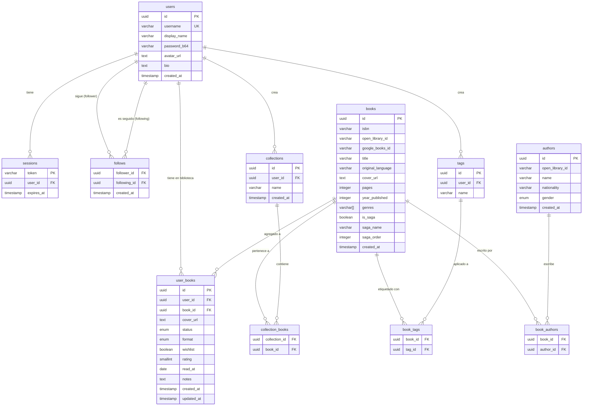

# Diagrama Entidad-Relación — La Biblioteca de Gabi

---

## Notas clave

**`books`** — catálogo global compartido. Un libro existe una sola vez aunque muchos usuarios lo tengan.

**`user_books`** — inventario personal. Cada fila es la relación entre un usuario y un libro. Aquí viven:
- `cover_url` — portada personalizada por usuario (sobreescribe la de `books`)
- `status` — estado de lectura personal
- `rating` — calificación personal
- `format` — físico / digital / audiolibro
- `wishlist` — si está en lista de deseos

**`follows`** — auto-referencia en `users`. `follower_id` sigue a `following_id`.

**`tags` y `collections`** — pertenecen al usuario, no al libro globalmente.
